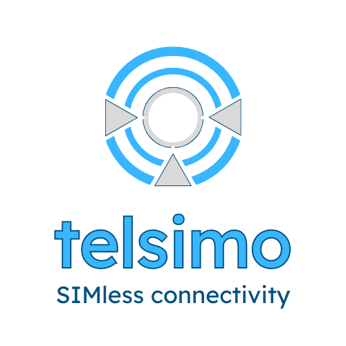
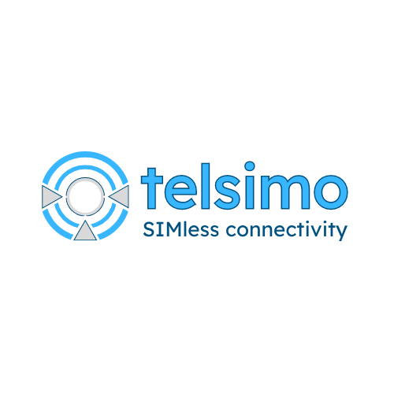

# logo.telsimo.com

**telsimo** - SIMless connectivity

## Description: 
Telsimo stands out as a powerful no-code platform that makes the management of eSIM and iSIM technology accessible and efficient for companies with diverse IoT applications. Its integration with tools like IFTTT and Make allows for seamless automation and enhanced workflow capabilities, making it an invaluable asset for businesses looking to optimize their IoT ecosystem with minimal effort and expertise.

## hahstags:
```
#IoT, #eSIM, #iSIM, #Connectivity, #NoCode, #Automation, #DigitalTransformation, #TechInnovation, #SmartDevices, #InternetOfThings, #IoTManagement, #IoTSolutions, #SecureConnectivity, #DeviceManagement, #EmbeddedSIM, #IntegratedSIM, #TechSolutions, #WirelessTechnology, #IoTSecurity, #SmartSensors, #AutomationTools, #DigitalEcosystem, #TechTrends, #ConnectedDevices, #TechForGood, #SmartTech, #TechFuture, #InnovativeTech, #IoTInnovation, #ConnectedAutomation 
```




